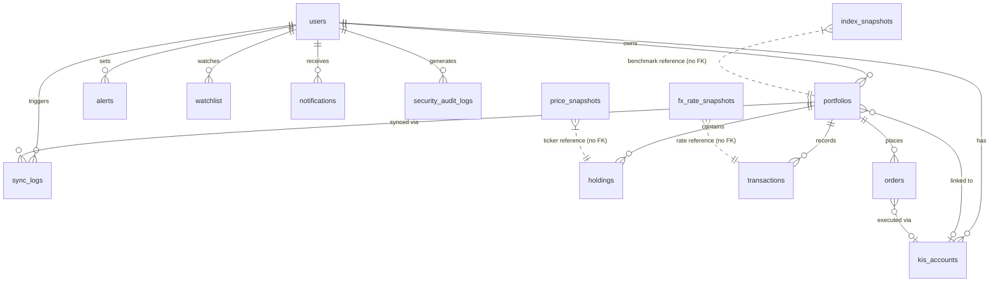

# Database Schema & Migration Workflow

14개 테이블 개요, ERD, 주요 인덱스, Alembic 체크리스트.

---

## 1. 테이블 목록 (14개)

| 테이블 | 목적 |
|--------|------|
| `users` | 사용자 계정 (이메일, 비밀번호 해시) |
| `portfolios` | 포트폴리오 (KIS 계좌 연결 가능) |
| `holdings` | 종목 보유 현황 (ticker, quantity, avg_price) |
| `transactions` | 매수/매도 거래 이력 |
| `orders` | KIS 주문 상태 (pending→filled→settled) |
| `kis_accounts` | KIS API 자격증명 (AES-256 암호화) |
| `alerts` | 가격 알림 설정 (above/below threshold) |
| `watchlist` | 관심 종목 |
| `price_snapshots` | 일별 종가 스냅샷 (analytics 데이터 소스) |
| `fx_rate_snapshots` | 일별 환율 스냅샷 (USD/KRW 등) |
| `index_snapshots` | 벤치마크 지수 스냅샷 (KOSPI200, S&P500) |
| `sync_logs` | KIS 잔고 동기화 이력 |
| `notifications` | 인앱 알림 |
| `security_audit_logs` | 보안 이벤트 감사 로그 |

---

## 2. ERD (Mermaid)



---

## 3. 테이블 상세

### users
```
id PK, email UNIQUE, hashed_password, name, created_at
```

### portfolios
```
id PK
user_id FK(users.id CASCADE)
name, currency (KRW), display_order, target_value
kis_account_id FK(kis_accounts.id SET NULL) UNIQUE  ← 1 portfolio : 1 KIS account
created_at
```

### holdings
```
id PK
portfolio_id FK(portfolios.id CASCADE)
ticker, name
quantity NUMERIC(18,6), avg_price NUMERIC(18,4)
market (KRX | NASDAQ | NYSE | ...)
created_at
```

인덱스: `portfolio_id` (FK 자동)

### transactions
```
id PK
portfolio_id FK(portfolios.id CASCADE)
ticker INDEX, type (BUY | SELL)
quantity NUMERIC(18,6), price NUMERIC(18,4)
traded_at, deleted_at (soft delete)
memo, order_no, order_source, tags ARRAY
```

### orders
```
id PK
portfolio_id FK(portfolios.id CASCADE)
kis_account_id FK(kis_accounts.id SET NULL)
ticker INDEX, name
order_type (BUY | SELL)
order_class (market | limit)
quantity NUMERIC(18,6), price NUMERIC(18,4) nullable
order_no (KIS ODNO)
status INDEX (pending | filled | partial | cancelled | failed)
filled_quantity, filled_price
memo, created_at
```

### kis_accounts
```
id PK
user_id FK(users.id CASCADE)
label, account_no, acnt_prdt_cd
app_key_enc String(512)    ← AES-256-GCM 암호화
app_secret_enc String(512) ← AES-256-GCM 암호화
is_paper_trading BOOL
account_type (일반 | ISA | 연금저축 | IRP)
created_at
UNIQUE(user_id, account_no, acnt_prdt_cd)
```

### alerts
```
id PK
user_id FK(users.id CASCADE) INDEX
ticker, name
condition ENUM(above | below)
threshold NUMERIC(18,4)
is_active BOOL
created_at, last_triggered_at
```

### watchlist
```
id PK
user_id FK(users.id CASCADE) INDEX
ticker, name, market
added_at
UNIQUE(user_id, ticker)
```

### price_snapshots
```
id PK
ticker INDEX, snapshot_date DATE
open, high, low NUMERIC(18,4)
close NUMERIC(18,4) NOT NULL
volume BIGINT
created_at
INDEX(ticker, snapshot_date) — 복합 인덱스
UNIQUE(ticker, snapshot_date)
```

### fx_rate_snapshots
```
id PK
currency_pair (예: USD/KRW), rate NUMERIC(18,6)
snapshot_date DATE
created_at
UNIQUE(currency_pair, snapshot_date)
```

### index_snapshots
```
id PK
index_code (KOSPI200 | SP500) INDEX
timestamp TIMESTAMPTZ
close_price NUMERIC(18,4)
change_pct NUMERIC(8,4)
created_at
UNIQUE(index_code, timestamp)
```

### sync_logs
```
id PK
user_id FK(users.id CASCADE) INDEX
portfolio_id FK(portfolios.id CASCADE)
sync_type, status (success | error)
inserted, updated, deleted INTEGER
message, synced_at
```

### notifications
```
id PK
user_id FK(users.id CASCADE) INDEX
type (system), title, body TEXT
is_read BOOL
created_at
```

### security_audit_logs
```
id PK
user_id FK(users.id SET NULL) INDEX
action ENUM(AuditAction) — 7가지 이벤트
ip_address String(45), user_agent TEXT
meta JSONB
created_at INDEX
INDEX(user_id, created_at) — 복합 인덱스
```

---

## 4. 주요 인덱스 근거

| 인덱스 | 테이블 | 근거 |
|--------|--------|------|
| `ticker` | `holdings`, `transactions`, `orders` | 종목별 조회 빈번 |
| `portfolio_id` | `holdings`, `transactions`, `orders` | 포트폴리오별 조회 |
| `status` | `orders` | settlement 스케줄러가 `WHERE status IN ("pending", "partial")` 쿼리 |
| `(ticker, snapshot_date)` | `price_snapshots` | analytics 날짜 범위 쿼리 |
| `(user_id, created_at)` | `security_audit_logs` | 사용자별 감사 로그 최신순 조회 |
| `(currency_pair, snapshot_date)` | `fx_rate_snapshots` | UNIQUE + 날짜 조회 |

---

## 5. Alembic Autogenerate 검증 체크리스트

`alembic revision --autogenerate -m "description"` 후 생성된 파일에서 반드시 확인:

```
[ ] ForeignKey ondelete 옵션이 맞는지 (CASCADE vs SET NULL)
[ ] UniqueConstraint 이름이 명시적으로 설정되어 있는지 (autogenerate가 누락할 수 있음)
[ ] 복합 Index가 생성됐는지 (단일 컬럼 인덱스와 별도 확인)
[ ] JSONB, ARRAY 등 PostgreSQL 전용 타입이 올바르게 생성됐는지
[ ] Enum 타입이 create/drop 됐는지 (PostgreSQL은 Enum을 별도 타입으로 관리)
[ ] NULL 허용 기본값 변경이 포함됐는지 (nullable=True → False 변경 시 기존 데이터 문제)
[ ] 마이그레이션 파일의 downgrade() 함수가 올바르게 reverse인지
```

**이중 헤드 발생 시**:
```bash
alembic merge heads -m "merge conflicting heads"
alembic upgrade head
```

---

## 6. Alembic env.py 비동기 설정 주의사항

`backend/alembic/env.py:7,48`:
```python
from sqlalchemy.ext.asyncio import async_engine_from_config

connectable = async_engine_from_config(...)
```

`asyncpg` 드라이버(`postgresql+asyncpg://`)를 사용. 주의:
- `alembic offline` 모드에서는 sync URL 필요 — `DATABASE_URL`에서 `asyncpg` → `psycopg2`로 교체 필요 (현재 offline 모드 미사용)
- `NullPool` 사용 권장 (tests/conftest.py와 동일 패턴) — 마이그레이션 후 연결 풀 잔여 문제 방지
- `app.models` 전체 import 필수: `import app.models  # noqa: F401` (`env.py:13`) — autogenerate가 모든 테이블 감지하도록

---

## 7. Seed 데이터

현재 별도 seed 스크립트 없음. 개발 환경에서는 앱을 통해 직접 데이터 생성:
1. `/register` — 테스트 계정 생성
2. `/dashboard/portfolios/new` — 포트폴리오 생성
3. Settings → KIS 계정 연결 (모의투자 계정 사용 권장)

E2E 테스트용 계정: `VISUAL_QA_EMAIL`, `VISUAL_QA_PASSWORD` env var (`.env.example` 참조)

---

## Related

- [`docs/architecture/security-model.md`](./security-model.md) — KIS 자격증명 암호화, audit_logs
- [`docs/architecture/feature-trading.md`](./feature-trading.md) — orders 테이블 status 전이
- [`docs/architecture/feature-analytics.md`](./feature-analytics.md) — price_snapshots, fx_rate_snapshots 사용
- [`docs/runbooks/troubleshooting.md`](../runbooks/troubleshooting.md) — Alembic head conflict 해결
